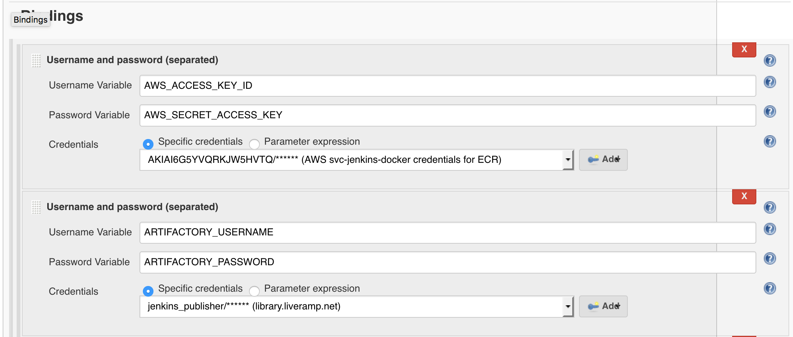

# Setup

## Install the Gem

Install the `kube_deploy_tools` gem in your project.

Gemfile:
```ruby
source 'http://gemserver.***REMOVED***'

group :kdt do
  gem 'kube_deploy_tools', '~> 1.0'
end
```

```bash
bundle install
```

If you only need to install kdt (typically only applies to deployment servers like rampmaster)
```bash
bundle install --with kdt --without default development test
```

## Create deploy.yml

Add a deploy.yml to the root of your project.

```bash
cat << EOF > deploy.yml
deploy:
  clusters:
    - target: local
      environment: staging
    - target: colo-service
      environment: prod
    - target: colo-service
      environment: staging
  flavors:
    default: {}
EOF
```

Edit deploy.yml to only include the Kubernetes clusters your project will
deploy to.

For a full list of supported clusters, see
[examples/projects/deploy.yml](../examples/project/deploy.yml).

## Create Kubernetes manifests into kubernetes/

Use your project's `kubernetes/` directory for storing your Kubernetes manifests.

File types can either be `.yaml` or `.yaml.erb`, and files may be stored into
subdirectories. For example:

```
kubernetes/
  configmap-my-todo-list.yaml
  my-todo-app/
    dep-my-todo-app.yaml.erb
    service-my-todo-app.yaml
```

See [documentation/kube_manifests_with_erb.md](kube_manifests_with_erb.md)
for writing Kubernetes manifests with ERB.

The manifests in the `kubernetes/` directory will be rendered by
`kube_deploy_tools` into the `build/kubernetes/` directory, where deploy
artifacts will be compressed and published to Artifactory.

Thus, add the `build/` directory to your .gitignore file.

## Set up Jenkins build steps

The Jenkins build should run on Docker-enabled Jenkins workers.
In General > Restrict where this project can be run, set the Label Expression to
`docker2`.

A Jenkins build step is required to build, tag, and push all of your Docker images.
See [documentation/deploy.md](deploy.md) for more.

A Jenkins build step is required to render Kubernetes manifests and deploy
artifacts.

```bash
bundle exec kdt render_deploys
```

A Jenkins build step is required to publish your project's deploy artifacts to
Artifactory. See the image below and instructions.



* Under Build Environment, check Generic Artifactory Integration, and then the
Artifactory Configuration sections will appear.
* In Artifactory Configuration > Upload Details > Artifactory upload server,
fill with http://***REMOVED***/artifactory.
* In Artifactory Configuration > Upload Details > Upload spec source > File Path,
fill with `build/kubernetes/artifactory.json`.
* In Artifactory Configuration > Download Details > Artifactory download server,
fill with http://***REMOVED***/artifactory.

## Directory structure

```
project/root/
  Gemfile                       # contains gem 'kube_deploy_tools'
  Gemfile.lock
  deploy.yml                    # deployment config for your project
  .gitignore                    # the build/ directory is git ignored
  build/                        # don't commit this directory, it's generated by kube_deploy_tools
    kubernetes/
      artifactory.json          # generated file used in your Jenkins build
  scripts/
    render_deploys_hook
```

